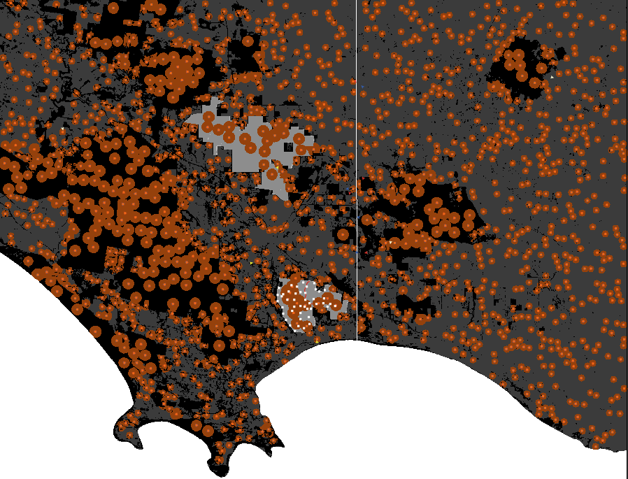
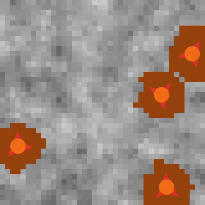

```{r setup, include = FALSE}
knitr::opts_chunk$set(
  collapse = TRUE,
  comment = "#>"
)
library(knitr)
library(kableExtra)
library(png)
library(pander)
setwd("C:/Users/hradskyb/Dropbox/personal/bron/ibm/foxnet_github/user_guide")
```


\pagebreak

### Notation {-}

The names of *agent-sets* are *italicised*.  An *agent-set* is a group of the same entities within FoxNet.

**Submodel names** are in **bold**.  

`Parameter names` are shown in `code font`.  

"Input values" for a `parameter` are shown in "quotes".  "Input values" can be varied to customise the FoxNet modelling framework to a scenario and explore key sensitivities. 


   
   
\vspace*{\fill}

This project is licensed under the GNU General Public License v3.0 - see the LICENSE.md file for details.

### To cite this User Guide {-}
Hradsky B, Kelly L, Robley A, Wintle B (2019) FoxNet: an individual-based modelling framework to support red fox management *Journal of Applied Ecology*.

### Software source {-}

Data available via Zenodo http://doi.org/10.5281/zenodo.2572045 (Hradsky et al. 2019b).  A current version of FoxNet and the User Guide is also maintained at this location. 

### For further information or help with customising model code{-}
Email <hradskyb@unimelb.edu.au> or <bhradsky@gmail.com>  

### The development of FoxNet was funded by the {-}
- Australian Government's National Environmental Science Program through the Threatened Species Recovery Hub
- Victorian Government (Department of Environment, Land, Water and Planning)
- Parks Victoria
- Australian Research Council Linkage Project 170101134


\pagebreak

# About FoxNet

## Overview

FoxNet is a customisable, individual-based modelling framework for running spatially-explicit red fox population models at a landscape-scale.  It can be used to predict red fox population density, age structure, composition and responses to management across an entire landscape or within customised region(s) of interest.


## Components

FoxNet has four main types of agent: *habitat-cells*, *foxes*, *fox-families* and *bait-stations*. Another two types of short-lived agent (*vacancies* and *barrier-testers*) are used to execute territory-checking and barrier-testing processes efficiently.  

*Habitat-cells* are the squares of habitat that define the spatial resolution, configuration and productivity of a model landscape in FoxNet.  Within a *habitat-cell*, productivity and *fox* access to *bait-stations* is homogenous.  The area represented by each *habitat-cell* can be specified using `cell-dimension`, and is usually in the order of 0.01 km^2^ to provide a compromise between computational efficiency and intra-home-range variation  (fox home-range size varies between <0.5 and >9 km^2^; Trewhella et al. 1988). Each *habitat-cell* keeps track of the following parameters:  

- `habitat-type`: an integer that denotes the type of habitat (e.g. "0" = ocean, "1" = forest, "2" = farmland, "3" = heathland). If the model landscape is generated within FoxNet, there will only be one `habitat-type`. However, if the model landscape is imported as an ascii raster layer, the `uninhabitable-raster-value`, `second-habitat-raster-value`, `hab2:hab1`, `third-habitat-raster-value` and `hab3:hab1` inputs can be used to specify, respectively, a raster integer value that denotes *habitat-cells* that are not available to *foxes* (such as ocean or lakes), a raster integer value that denotes a secondary type of habitat (e.g. farmland if the primary habitat type is forest) and the productivity of the second `habitat-type` relative to the primary `habitat-type`, and a raster integer value that denotes a third type of habitat (e.g. heathland) and the productivity of the third `habitat-type` relative to the primary `habitat-type`.  The productivity of the *habitat-cells* determines how many *habitat-cells* a *fox-family* needs to acquire to establish a territory (see below).

- `available-to-foxes`: "true" or "false". This parameter defaults to "true" unless the *habitat-cell*'s `habitat-type` is the same as the `uninhabitable-raster-value` for an imported landscape. In this case, the *habitat-cell* becomes unavailable to *foxes* and is not included in the `available-landscape-size`.  This allows to you to specify areas that *foxes* cannot access, such as oceans, lakes, predator-proof fenced areas etc. Cells underlying a barrier are also unavailable to foxes.  
  
- `part-of-region-of-interest`: "true" or "false". This parameter defaults to "false". When "true", the *habitat-cell* becomes part of the `region-of-interest` where the *fox* population is monitored (e.g. a central square or a nature reserve).  The `region-of-interest` can be the entire landscape if desired.

- `part-of-region-of-interest[2 - 6]`: An additional 5 parameters, each set to "true" or "false". They default to "false".  When "true", the *habitat-cell* becomes part of region of interest X (`region-of-interest2`, `region-of-interest3`, etc.) where the *fox* population is also monitored (e.g. a second and third (up to 6th) nature reserve).  

- `true-color`: the intrinsic colour of the *habitat-cell* when unoccupied by a *fox-family*.  This defaults to black for the primary habitat type, but will be a different colour if the *habitat-cell* is the secondary habitat type, is not available to foxes, or is part of the region(s)-of-interest. 

- `true-productivity`: the intrinsic amount of food available to a *fox* in the *habitat-cell* during each time-step (in grams time-step^-1^). The `true-productivity` of *habitat-cells* in the primary habitat type is calculated from the size of an average fox home-range (input by the user) and the daily food requirements of an adult fox (378 g/day; Lockie 1959); an approach similar to Carter et al. (2015) but which facilitates scenario customisation.  `True-productivity` in the secondary habitat-type (if applicable) depends on the `hab2:hab1` ratio. See the **[set-landscape-productivity]** submodel for more information.  

- `current-productivity`: the current amount of food available to a *fox* in the *habitat-cell* during each time-step (in grams time-step^-1^). The `current-productivity` of each *habitat-cell* determines how many *habitat-cells* *foxes* need to acquire to establish a territory - see the **[fox-families-check-territories]** and **[foxes-disperse]** submodels. By default, a *habitat-cell's* `current-productivity` is the same as its `true-productivity`, but it can be varied spatially or temporally through manual coding. Future extensions will use this feature to incorporate disturbance events such as fire that have short-term effects on red fox habitat selection.  

- `fox-family-owner`: the identity of the *fox-family* that currently owns the *habitat-cell* (set to "nobody" when the cell is unowned). 

- `cell-relative-productivity`: set to 0 by default.  However, if the *habitat-cell* is owned by a *fox-family*, it is calculated as the `current-productivity` of the *habitat-cell* weighted by the inverse of its distance from the centre of the *fox-family's* territory. This value is updated by the *fox-family*.  

- `cell-relative-use`: set to 0 by default. However, if the *habitat-cell* is owned by a *fox-family*, it is calculated as the intensity with which the *habitat-cell* is used by the *fox-family*, i.e., the `current-productivity` of the *habitat-cell* divided by the total productivity of the *fox-family*'s territory. For example, in a homogeneous landscape with a territory-size of 100 ha and 1-ha *habitat-cells*, `cell-relative use` would be 0.01.  However, if the territory-size was 500 ha, `cell-relative-use` would be 0.002. `cell-relative-use` is used to scale the exposure of *foxes* to *bait-stations* with territory-size and *habitat-cell* productivity, and to derive the density of *foxes* (a monitoring output).  

- `cell-fox-density`: set to 0 by default  (or 999 for cells that are not available to foxes). However, if the *habitat-cell* is owned by a *fox-family*, it is calculated as `cell-relative-use` multiplied by the number of *foxes* in the *fox-family*. This is used to calculate the density of *foxes*. For example, if 4 *foxes* share the 500-ha territory and `cell-relative-use` is 0.002, `cell-relative-use-foxes` is 0.222 x 4 = 0.008.   

- `cell-fox-density-no-cubs`: as for `cell-fox-density` but excludes cubs from the count of *foxes* in the *fox-family*.

- `checked-already`:  "no" (default) or "yes": indicates whether the *fox-family* owner has already considered discarding this *habitat-cell*.  Used to speed up the **[update-territory]** submodel.

*Foxes* are mobile individuals whose behaviour is determined by their `age` and `status`, and the time of year (Larivière & Pasitschniak-Arts 1996). Each "alpha" *fox* is a member of a *fox-family* .  *Foxes* have the following characteristics:  

- `age`: in weeks.  *Foxes* are born at `age` "0".  

- `sex`: "female" or "male".  

- `status`: "cub", "subordinate", "disperser" or "alpha", depending on the *fox*'s `age` and territory-holding status.  

- `natal-id`: the *fox-family* that the *fox* was born into.  

- `natal-cell`: the *habitat-cell* where the *fox* was born.  

- `family-id`: the *fox-family* that the *fox* currently belongs to.  

- `my-dispersal-distance`: the distance (km) that the *fox* intends to move from its `natal-cell` (drawn from a random-exponential distribution which is influenced by the *fox*'s sex and size of its natal territory) - see the **[foxes-disperse]** submodel.  

- `distance-from-natal`: the current distance of the *fox* from its `natal-cell` (in kilometres).  

- `my-dispersal-duration`: the length of time the *fox* has been attempting to join or establish a new territory (in weeks).  

- `failed-territory-id`: a list of this *fox*'s territories which have failed.  

*Fox-families* are used to establish and update the territories of their family-members (foxes within a family share a semi-exclusive territory; Sargeant 1972). A *fox-family* must contain at least one "alpha" *fox*, and may also include the alpha's mate, cubs and subordinate offspring.  *Fox-families* have the following characteristics:  

- `family-members` - an agent-set comprising the "alpha female" and/or "alpha male" *fox*, and any of their "cub" or "subordinate" offspring that have not yet dispersed.  

- `my-territory` - an agent-set comprising the *habitat-cells* held as territory by the *fox-family*.  

- `territory-productivity`: the total productivity of the *fox-family*'s territory.  

- `vacancy-score`: the sum of the `relative-productivity` values of the *vacancy* agents surrounding the territory at the end of the last time-step.  *Fox-families* only try to improve their territory if the `vacancy-score` this time-step is different - this helps the model run more efficiently.  The `vacancy-score` will change if the `current-productivity` of the *habitat-cells* has changed, if new *habitat-cells* have become available through the death of a *fox-family*, or if location of the *fox-family* has changed.  See the **[fox-families-check-territories]** submodel.

*Bait-stations* are static agents that mark the locations of baiting sites (this is more efficient than using the habitat-cells to record this). *Bait-stations* track:  

- `bait-present` - whether a bait is currently available ("true" or "false").  

- `Pr-death-bait-scaled` - the likelihood of the bait affecting a *fox* whose territory overlaps it. 

*Vacancies* are temporary static agents. They are briefly created and used by *fox-families* to (a) identify any *habitat-cells* that are adjacent to their territory and not owned by another *fox-family*, and (b) determine the `relative-productivity` of each of these available *habitat-cells* (i.e. the `current-productivity` of the *habitat-cell* weighted by the inverse of its distance from the centre of the *fox-family's* territory).  The sum of these values becomes the *fox-family's* `vacancy-score` for that time-step.  *Vacancies* are removed at the end of each *fox-family's* territory-checking procedure and are simply used to help the model run efficiently.

*Barrier-testers* are temporary agents.  They are briefly created and used by a *fox* to check whether a straight line (link) between the *fox*'s current location and another point intercepts a barrier (if there are any barriers in the model landscape), e.g. when the *fox* is trying to disperse.  They are  removed immediately after the test.

## Temporal and spatial scales

FoxNet progresses in time-steps (or ticks) of 1, 2 or 4 weeks, depending on the `weeks-per-timestep` setting.  There are 52 weeks per year (and therefore 13 'months', each of 4-weeks duration). A series of processes occur consecutively each time step, and key seasonal events are linked to `week-of-year`, making the framework customisable to northern- and southern-hemisphere scenarios.  

The landscape can either be generated within FoxNet (as a square with the area specified by the `landscape-size` input parameter), or uploaded as raster layer, with each cell of the raster corresponding to a *habitat-cell* in the model. By default, the landscape doesn't wrap (i.e. boundaries are non-permeable).  


## Process overview and scheduling

Each timestep, FoxNet works through a series of processes in order. Because key seasonal events are linked to week-of-year, the framework is customisable to northern- and southern-hemisphere scenarios. There is no hierarchy among agents of the same type (i.e. the order in which agents conduct each process is random and varies each time-step).  

The key processes are as follows:

(@) Year and week counters are updated (by 1, 2 or 4 weeks, as required). Key seasonal events are linked to week-of-year, making FoxNet customisable to northern- and southern-hemisphere scenarios.

(@) The `age` of each *fox* is updated by the appropriate number of weeks. "Cub" *foxes* become "subordinates" if they have reached the `age-of-independence`. If it is the dispersal season, "subordinate male" and "subordinate female" *foxes* have user-specified probabilities of becoming "dispersers". See the **[update-fox-age-and-status]** submodel.

(@) Natal succession occurs within *fox-families*. That is, if a *fox-family* is missing an "alpha" *fox*, one of the family’s "subordinates" that is the right sex and at least 24 weeks old becomes the "alpha" (as described by Baker et al. 1998).


```{r, echo = FALSE, fig.show='hold', out.width = "50%", fig.align='center'}


```

(@) *Fox-families* check their territories. *Fox-families* seek to maximise their `territory-productivity` within a compact area by acquiring or replacing *habitat-cells*. This enables the *fox-family* to take over unoccupied productive *habitat-cells* (Sargeant 1972), and respond to changes in resource availability (Bino et al. 2010; Hradsky et al. 2017b). If the `territory-productivity` of *fox-family*’s territory is less than an adult fox’s minimum food requirements (<295 g/day; Winstanley et al. 2003), the *fox-family fails*, causing all adult *foxes* in the family to become "dispersers" and any "cubs" to die. See the **[fox-families-check-territories]** submodel.  

(@) If applicable, baits are laid at *bait-stations* and the cost of the baiting session is calculated. *Foxes* belonging to a *fox-family* with a territory that overlaps an active *bait-station* are at risk of dying. Risk scales directly with the number of *bait-stations* and bait efficacy, and inversely with territory size and the number of *foxes* in the familiy. Each *bait-station* only affects one *fox* each time-step. See the **[bait-if-applicable]** submodel.

(@) *Foxes* who have just become "dispersers" leave their natal *fox-family* and move a random distance generated from a sex-specific exponential distribution, scaled by their territory-size (Trewhella et al. 1988).  "Disperser" *foxes* then explore the area within their `territory-perception-radius` (set to an area three times the radius of an average home-range; Soulsbury et al. 2011) where they (1) are exposed to any active *bait-stations*; (2) attempt to join a *fox-family* that lacks an "alpha" *fox* of the appropriate sex; (3) try to establish a new *fox-family*. If unsuccessful, they remain a "disperser" until the next time-step. See the **[foxes-disperse]** submodel.

(@) If it is the breeding season, *fox-families* that contain an "alpha" male and an "alpha" female *fox* breed, producing a Poisson-distributed number of "cub" *foxes*. If an "alpha" *fox* is absent, all family-members become dispersers and attempt to join other nearby *fox-families*, promoting the persistence of the population at low densities. See the **[fox-families-breed]** submodel.


(@) Provided that `include-fox-mortality` is "on", stochastic background mortality of *foxes* occurs, based on their age. See the **[foxes-die]** submodel.

(@) "Cub" *foxes* belonging to *fox-families* without any adults die, reflecting their dependence on food-provision (Baker et al. 1998). This allows baiting to affect reproductive success. Defunct *fox-families* (those that have no family members) are removed from the model.

(@) Model outputs are updated (and plotted if specified). Outputs can include age structure, population structure, dispersal distances, density or number of neighbours of *foxes* within the `region-of-interest`(s), the number of *foxes* with territories overlapping a monitoring transect, and/or bait-take rates.  See the **[update-monitors]** submodel.

(@) If baits were deployed at *bait-stations* at step 5, any baits that were not eaten by *foxes* are removed to mimic the removal of baits by managers or the degradation of the poison to non-toxic levels (Saunders et al. 2000).

(@) The time-step (tick) counter increases by 1.  

(@) The model checks if any foxes are alive. 
If all *foxes* are dead, the model stops.

Detailed descriptions of the submodels underlying these processes can be found in [Chapter 8][Submodels]

## Design concepts

### Basic principles
The size of a *fox-family's* territory depends on the productivity of the *habitat-cells*, and can be updated in response to changes in the productivity or availability of these *habitat-cell*.

*Foxes* with established territories are only exposed to *bait-stations* within their territory. "Disperser" *foxes* are exposed to *bait-stations* within their `territory-perception-radius`.

### Emergence
The density of *foxes*, the distribution of ages and dispersal-distances within the population, and the configuration of *fox-family* territories emerge over time from demographic processes, territory dynamics and the spatial configuration of different `habitat-types`.   

Bait-take rates result from the configuration of active *bait-stations* relative to *fox-family* territories and the relative-use of *habitat-cells*, *fox* density, and the likelihood of a *fox* consuming a bait.

### Adaptation
*Fox-families* adapt the size and position of their territory to the productivity of the *habitat-cells* and the presence of surrounding *fox-families*.  

### Objectives
Each *fox-family* aims to maximise the productivity of its territory (up to 110% of an adult fox's daily food requirements) within as compact an area as possible.

"Disperser" *foxes* seek to join an existing *fox-family* as an "alpha", or establish their own *fox-family*.

*Foxes* seek to breed, and so will disband their *fox-family* if it lacks an "alpha" of the opposite sex during the breeding period.  

###	Sensing
When they are dispersing, *foxes* can sense the location of *fox-family* territories and unoccupied *habitat-cells* within their `territory-perception-radius`.  

*Fox-families* can sense the productivity of the *habitat-cells* within their territory.   They can also sense the productivity and availability of the *habitat-cells* surrounding their territory, via the *vacancy* agents.  

###	Interaction
*Fox-families* indirectly compete for *habitat-cells*, as each *habitat-cell* can only be used by one *fox-family*.  The *fox-families* use *vacancy* agents to determine which *habitat-cells* surrounding their territory are currently available. This effectively limits the carrying-capacity of the landscape, as only *foxes* within *fox-families* can breed.  See [Effect of productivity on fox density](#anchor).

###	Stochasticity
Stochasticity occurs throughout the model to represent natural variation, including the dispersal locations of *foxes*, *fox* sex and survival rates, and *fox-family* territory-acquisition and litter size.  

###	Collectives
The `region-of-interest`(s) is nominated by the user, and defines the area(s) in which *foxes* are monitored.

*Foxes* form family-groups (represented by a *fox-family* agent) which share a territory.  The status of each *fox* is influenced by the `sex` and `status` of its other family-members. 

The survival of a "cub" fox depends on the presence of at least one adult member in its *fox-family* until it reaches the `age-of-independence`.

###	Observation
At the end of each time-step, data can be collected on the *foxes*, *fox-families* and *bait-stations*. The user specifies which data to collect and plot. See the **[update-monitors]** submodel.


## Initialisation

FoxNet initialises by setting the input parameters as per the model interface, and then running through the following processes in order:

1. A random-seed is set and recorded, so that the model run can be reproduced exactly if required.

1.	**set-current-directory.**
The current directory is set to the `working-directory` so that any spatial layers can be easily imported and model outputs will be saved in the appropriate folder.

1.	**check-for-errors.**
This checks for inconsistencies in the input parameters.  If an error is found, the model returns a detailed error message and stops. See the **[check-for-errors]** submodel.   

1.	**calculate-conversion-factors.**
This calculates the factors for converting between input units and the model (e.g. km^2^ to *habitat-cells*).  

1.	**set-fox-parameters.**
This sets a variety of parameters which are not available on the interface and derives others, such as the duration of the dispersal season. See the **[set-fox-parameters]** submodel.  

1.	**create-world.**
This generates a landscape of an appropriate size, either by generating it within the model or importing a raster layer. See the **[create-world]** submodel.

1.	**identify-region-of-interest.**
This identifies the part of the landscape in which *fox* populations will be monitored. This may be the entire landscape or a subset group of *habitat-cells*. See the **[identify-region-of-interest]** submodel.

1.	**set-landscape-productivity.**
This calculates the distribution of productivity values across the *habitat-cells* using the `home-range-area` and `kernel-percent` inputs.  See the **[set-landscape-productivity]** submodel.

1.	**set-up-bait-stations.**
This sets up the *bait-stations* across the landscape (if applicable). See the **[set-up-bait-stations]** submodel. 

1. **set-up-survey-transect.** 
This sets up a survey transect for monitoring the number of foxes, if applicable.

1.	**set-up-foxes.**
This creates an initial number of *foxes* at the specified density. Each *fox* immediately disperses and tries to join an existing *fox-family* or establish a new *fox-family*. See the **[set-up-foxes]** submodel.

1.	**update-monitors.**
This calculates the model ouputs and plots them if applicable. See the **[update-monitors]** submodel.

1. Finally, the model resets the time-step counter.

\pagebreak  


# Getting started

## Installing NetLogo and opening FoxNet

FoxNet V 1.0 was built in NetLogo (Wilensky 1999) version 6.0.2 and used the R package `rnetlogo` to run model experiments.

FoxNet V 2.0 was updated for NetLogo 6.2.2 and includes an example of how to run experiments using the R package `nlrx`.

NetLogo is an open-source modelling environment, downloadable from <https://ccl.northwestern.edu/netlogo/>. FoxNet is saved in within the FoxNet folder: `FoxNet_model / FoxNet.nlogo`.  You can open it from within NetLogo or by double-clicking the file name.

For an introduction to using NetLogo see <https://ccl.northwestern.edu/netlogo/docs/>, particularly the three tutorials listed in the LH menu.

## The user interface
When you first open FoxNet, you should see the graphic user interface.  The interface has four key sections:  

1.	*Inputs* (green) - these boxes and sliders allow you to set model parameters and customise FoxNet to your scenario.  

2.	*Buttons* (mauve) - these are used to control FoxNet:  

+ **setup** will parameterise FoxNet with whatever settings you have chosen in the inputs.

+ **go** will run FoxNet for one timestep.

+ **go (continuous)** will run FoxNet forever (or at least until you click the button again) - this is shown by the circling arrows.

+ **export** will export a spatial layer of fox density (excuding cubs) to the folder specified in your `output file path` as an .asc file.

+ **territory-demo** will provide a demonstration of key model processes relating to fox territories - see [Model demonstration].  

+ **basic-scenario** will setup FoxNet with a simple example scenario - see [Building a simple scenario from scratch].

+ **glenelg-scenario** will setup FoxNet with a complex scenario to demonstrate all the bells and whistles (see [An example customisation]).  You must set the `working-directory` to the location of the FoxNet folder to use this option.  

3.	*World-view* (large black square) - this depicts some aspects of the model so that you can watch what is happening as you run FoxNet.  

4.	*Outputs* (beige boxes and plots) - these enable you to track key model outputs.

```{r, echo = FALSE, fig.show='hold', out.width = "100%"}


```

At the top of the screen, there are additional controls that affect how FoxNet displays, including a slider that controls the model speed, a tick-box that specifies whether you want to watch updates in the world-view or not, and a drop-down option for whether updates should be shown continuously or just at the end of each time-step.  

Under the Settings button, you can adjust the number of pixels per cell in the world-view and the frame rate.  

> TIP: To make the world-view larger/smaller you can increase/decrease the number of pixels per cell.  If the world-view is too large, you may encounter memory constraints.

```{r, echo = FALSE, fig.show='hold', out.width = "100%"}


```

  
  
At the bottom of the screen is the command center where you can issue direct instructions to the model.  Information on what is happening during the **territory-demo** is also shown here.


```{r, echo = FALSE, fig.show='hold', out.width = "100%"}


```

## The code  

The underlying model code can be viewed by clicking across to the Code tab.  Submodels are provided in separate files, which can be viewed by clicking on the Included Files dropdown box, within the Code tab. Ignore this for now - you don't need to view or edit the code to build or run a model in FoxNet.


## Model demonstration

FoxNet comes with a build-in demonstration of several key processes, including territory formation, fox responses to changes in habitat productivity, mate-seeking and reproduction.

Click on **territory-demo** (mauve button).  A description of what is happening will appear in the Command Center bar at the bottom of the screen.  You can expand this bar if you want to see more than one line of writing at once.

> TIP: To stop the demonstration (or any FoxNet model) part-way through, click Tools > Halt.


\pagebreak

# Building a simple scenario from scratch

## A fox population in a homogenous landscape

Let's start by building a simple landscape. Using the Interface tab, either:  

- Set the following inputs manually by moving the sliders and entering the values, and then click **setup**, OR  
- Click the mauve **basic-model** button (which will automatically set up the model with the same input parameters)


```{r, echo=FALSE, results='asis'}
inputs.basic.table <- read.csv("tables/inputs_basic.csv")


kableExtra::kable(inputs.basic.table) %>%
  kable_styling(bootstrap_options = c("striped", "hover", "responsive")) %>%
  group_rows(index = c("Landscape setup" = 5, "Fox parameters" = 17, "Baiting parameters" = 1, 
                       "Monitoring parameters" = 1))

```


These parameters are based on a fox population in Bristol, United Kingdom, with survival data from Devenish-Nelson et al. (2013), and breeding and dispersal data from Trewhella and Harris (1988). See Hradsky et al. (2019a) Table S1 for a full list of citations.

Whichever approach you chose, you should now see a black landscape with a central grey square in the world-view.  The entire landscape is 400 km^2^. The central grey square is your 'region-of-interest' where the *fox* population is monitored, and is 110.25 km^2^ ^[ Because FoxNet is generating a square lnadscape with 1 ha pixels (as specified by `cell-dimension`), it has had to adjust the size of the region-of-interest slightly]. These values are shown in the beige output boxes.

```{r, echo = FALSE, fig.show='hold', out.width = "50%", fig.align='center'}

include_graphics("figures/FoxNet_basic-scenario.png")

```

Now change `initial-fox-density` to "0.5" foxes km^-2^ by sliding or clicking the slider to the right.  

> TIP: You can also alter the value of a slider by right-clicking the slider, selecting "edit" and then typing in a new value in the appropriate box.
  
Click **setup** again.  A scattering of white and yellow triangles should appear - these are "female" and "male" *foxes* without territories (i.e. their `status` is "disperser").  Each *fox* should attempt to establish or join a circular brown territory. A *fox* with a territory acquires "alpha" `status`, becomes red ("female") or blue ("male"), and sits beneath an orange-coloured *fox-family* in the centre of its territory.  A "female" and "male" *fox* can share a territory.


```{r, echo = FALSE, fig.show='hold', out.width = "33%"}


```

> TIP: If you would like to slow this process down so that you can see what is happening, try sliding the speed toggle in the grey header bar to about 25% speed and click **setup** again. 

If you'd like to see the *foxes* more clearly, right-click the world-view > Edit, and change the  `patch-size` to 2 pixels.

Now click **go**. You might see a *fox* or two move, but not much else will change.  However, the beige year and week of year output boxes at the top of the screen will now show year 1, week 1.  

Click **go (continuous)**. As time progresses, *foxes*  breed, disperse, establish new territories and die.  

You can observe the density of *foxes* and *fox-families* within your 110 km^2^ `region-of-interest` by looking at the plot to the right of the world-view.  For example, by Year 5, week 13, the density of *foxes* has just spiked with the fifth breeding season, because the `cub-birth-season` is currently set to week 13 of the year (late March - see the [Week Conversion Table]). The density of *fox-families* remains relatively stable:  

```{r, echo = FALSE, fig.show='hold', fig.align='center', out.width = "100%"}


```

> TIP: To export the fox density data, right-click the plot and select "export". End the filename with ".csv".

Click **setup** and **go (continuous)** again. Each time you run the model with the same settings, you will get slightly different results due to stochastic variation.  

## Monitoring your model outputs  
  
The **basic-scenario** defaults to plotting the density of *foxes* and *fox-families* within the `region-of-interest`.  However, you can monitor other aspects of the *fox* population within the `region-of-interest` using the switches under MONITORING on the FoxNet interface.  Options include:  

- "age-structure" - the proportion of *foxes* in each age class from 0 to 8+ years.
- "bait-consumption" - the proportion of baits that have been removed by *foxes* per time-step.
- "count-neighbours" - the mean (min, max) number of territories directly abutting each *fox-family*'s territory.
- "density" - the density of *foxes* and *fox-families*.
- "dispersal distances" - the distance moved by *foxes* that have attempted to disperse.
- "family-density" - the density of *fox-families*. 
- "popn-structure" - the proportion of *foxes* in each demographic group. 
- "foxes-on-transect - the number of *foxes* who have territories that overlap the `survey-transect`.  This only works for landscapes that have been imported as a raster and where a survey transect shapefile has been uploaded.
- "home range size" - not provided in this version of FoxNet.


You can choose whether or not to plot summary values using the `plot?` button.  Plotting makes the model run more slowly.

## Experiment  

Have a play with the input parameters.  For example, try making `landscape-size` larger,  `initial-fox-density` higher, `home-range-area` bigger or switch `fox-mortality` to "off".  

> TIP: Huge landscapes with high densities of foxes may take a very long time to setup and run. To cancel a model at any point, select Tools > halt.

Note that all week-related inputs must be consistent with `weeks-per-timestep`.  FoxNet checks this during model set-up and will return an error if, for example, `weeks-per-timestep` is "4" but `cub-birth-season` is set to week "6".  

\pagebreak 

## Adding a baiting program

Return to the original settings by clicking **basic-scenario**.

Then alter the baiting parameters as follows to apply a uniform grid of *bait-stations* across your model landscape:

```{r, echo=FALSE, results='asis'}
inputs.baiting.table <- read.csv("tables/inputs_baiting.csv")


kableExtra::kable(inputs.baiting.table) %>%
  kable_styling(bootstrap_options = c("striped", "hover", "responsive")) %>%
  group_rows(index = c("Baiting parameters" = 6))

```

Click **setup** to see the layout of *bait-stations*.  

The current setting will have established a 1 km^-2^ grid of 400 *bait-stations* across your landscape.  

```{r, echo = FALSE, fig.show='hold', out.width = "45%", fig.align='center'}


```

If `initial-fox-density` is > "0" and you click "go", baits will be deployed at *bait-stations* every 4 weeks. Baits are deployed at *bait-stations* from the start of the model, but under the current settings only become poisonous from Year 3 week 13 - this allows the population to begin to establish without baiting, and enables you to quantify uptake of non-toxic baits (i.e. free-feeding).

> TIP: Baits are only deployed at bait-stations if the initial-fox-density is greater than 0.  

Setting `Pr-die-if-exposed-100ha` to "0.3" means that one *fox* with a 100-ha territory has a 30% chance of consuming a bait if one bait is deployed on its territory (and dying if the bait is toxic). The risk to a *fox* scales with the number of baits and inversely with the territory size and number of *foxes* in its *fox-family*.  See [Effect of baiting on fox mortality](#anchor)

Try altering `bait-density` to "4.0" baits km^-2^ or changing `bait-layout` to "random-scatter", and clicking **setup** again.  

```{r, echo = FALSE, fig.show='hold', out.width = "45%"}


```

Look at the effects of baiting on the population by changing the settings to a "grid" of baits with "2" baits km^-2^, setting `initial-fox-density` to "0.5" km^-2^, turning "on" the `bait-consumption` monitor, and then clicking **setup** and **go (continuous)**.

*Fox* density declines rapidly in Year 3 after the baits become toxic, in this case, going extinct by Year 8 week 21.  The model stops when all *foxes* are dead. Bait-take rates fluctuate with *fox* density. 

```{r, echo = FALSE, fig.show='hold', fig.align='center', out.width = "100%"}


```


```{r, echo = FALSE, fig.show='hold', fig.align='center', out.width = "100%"}


```

> TIP: By default, baits only remain at *bait-stations* for one time-step.  You can change the duration of a time-step to "1", "2" or "4" weeks.  Other durations require a customised code.  See foxnet / foxnet_model / foxnet_carnarvon_custombait.nlogo for an example.

Baits can be deployed at *bait-stations* at custom intervals (e.g. quarterly, only in winter or once per year), by changing `bait-frequency` to "custom*" and adding the relevant week numbers to `custom-bait-weeks`.  

> TIP: Make sure that the week inputs are surrounded by square-brackets, are consistent with the weeks-per-timestep parameter and do not include commas between values.  

For example, the following will deploy baits in weeks 6, 19, 31 and 45 each year (i.e. the start of February, May, August and November):


```{r, echo=FALSE, results='asis'}
inputs.baiting.table2 <- read.csv("tables/inputs_baiting_customweeks.csv")


kableExtra::kable(inputs.baiting.table2) %>%
  kable_styling(bootstrap_options = c("striped", "hover", "responsive")) %>%
  group_rows(index = c("Baiting parameters" = 2))

```


To calculate the cumulative annual cost of a baiting regime (displayed in a beige box to the right of the world-view), you can specify the price per bait deployed, the number of person-days it takes to deploy all baits in a single bait deployment, the number of kilometres travelled per bait deployment, and the cost of travel per kilometre. 
For example, if the parameters as set as follows...  


```{r, echo=FALSE, results='asis'}
inputs.baiting.table3 <- read.csv("tables/inputs_baiting_cost.csv")


kableExtra::kable(inputs.baiting.table3) %>%
  kable_styling(bootstrap_options = c("striped", "hover", "responsive")) %>%
  group_rows(index = c("Baiting parameters" = 1))

```


...a single bait deployment costs $2599,
and the cost of deploying baits every 4 weeks for a year is $33,792.

> TIP: The FoxNet interface constrains you to a baiting schedule that remains constant across years.  To vary the location of bait sites or baiting frequency between years, you will need to write a customised baiting schedule.  For an examplecode, open `foxnet_carnarvon_custombait.nlogo`, click across to the `Code` tab, then `Included Files` and select `bait_routines_carnarvon.nls`.  Please get in contact with model developers if you need help with writing a customised schedule.   

\pagebreak

# An example customisation

FoxNet models can be customised to real-world management landscapes using GIS layers that describe the landscape size and configuration of different habitat types, the area and location of the `region(s)-of-interest`, `survey-transect(s)`, and/or the layout of *bait-stations*.   

Example spatial layers are provided so that you can explore the suite of customisation features in FoxNet before developing your own. 


## Glenelg - a built-in scenario

To explore the built-in customised scenario:

1) Set the `working-directory` to wherever you have saved the FoxNet folder, for example: `C:/Users/hradsky/foxnet`.  

> Take careful note of the direction of the slashes if you are using Windows.  

2) Click **Glenelg-scenario**  

The world-view should now be much larger, and show an imported landscape layer with three different types of *habitat-cells*: forest (black), farmland (dark grey) and ocean (white, unavailable to *foxes*).  *Fox* home ranges are three times smaller in the farmland than the forest because of differences in the productivity of the *habitat-cells*.

Within the landscape, there are two `regions-of-interest` for monitoring the fox population. The first is mid-grey (to the south), and includes *bait-stations* (white squares) and a survey-transect (red line) for monitoring the number of *foxes*.  The second region-of-interest is lighter grey (to the north).  There is a also a north-south barrier to fox movement, just to the east of the regions of interest (white vertical line).


```{r, echo = FALSE, fig.show='hold', fig.align='center', out.width = "60%"}




```
  
If you'd like to see the landscape more clearly, set `initial-fox-density` to 0 and click **setup** again.

```{r, echo = FALSE, fig.show='hold', fig.align='center', out.width = "60%"}


```

3) Set `initial-fox-density` back to 0.5, and explore the effects of some of the other parameters .  After you change the parameters, you must click **set-up** again.  For example, make the productivity of the farmland the same as the productivity of the forest by changing the `hab2:hab1` slider to "1.00".

> TIP: Don't forget that you can make the model run more quickly by sliding the toggle at the top of the screen to the right.

## Building the Glenelg scenario from scratch  

Now let's work through each customisation process to build the Glenelg scenario from scratch

Once you are comfortable with how the Glenelg customisation scenario works, you can follow the same processes to customise FoxNet to your own management scenario. Additional information on how to do this is provided in [the next chapter][Building a new customised scenario].


### A customised landscape layer

Let's start by importing an ascii raster layer to create a customised landscape of south-western Victoria, Australia. This landscape is rectangular and contains three types of *habitat-cell*: forest, farmland and ocean.  

Begin by clicking "basic-scenario" to reset all your parameters. 

Alter the number of pixels per cell but clicking on the worldview > Edit... > Patch size > 0.5. 

Then adjust the following parameters and click "setup":


```{r, echo=FALSE, results='asis'}
inputs.glenelg.table <- read.csv("tables/inputs_glenelg.csv")


 kableExtra::kable(inputs.glenelg.table) %>%
   kable_styling(bootstrap_options = c("striped", "hover", "responsive")) %>%
   group_rows(index = c(" " = 1, "Landscape setup" = 6, "Fox parameters" = 1, "Baiting parameters" = 1))

```


The worldview should now look like this:  


```{r, echo = FALSE, fig.show='hold', fig.align='center', out.width = "60%"}


```

Forest (the primary habitat type, which has a value of "1" in the raster) is shown in black, farmland (the second habitat type, with raster value '0') is shown in dark grey, and the ocean (specified by raster value '2') appears white.  

> TIP. You can check these values by right-clicking a habitat-cell, selecting inspect patch x y and then seeing the integer shown next to habitat-type.

The `region-of-interest` has still been generated within the model and so forms a 200 km^2^ lighter-shaded block in the centre of the landscape.  

At the top of the interface, the output box `actual landscape size` shows the area habitable by *foxes* (4970.79 km^2^).  

The total size of the landscape including the ocean is 6260.46 km^2^. To find this out, type  `count patches * cells-to-km2` into the command centre at the bottom of the screen.

### Add some foxes

Provided the `intial-fox-density` is large enough that the population doesn't go extinct through stochastic processes, the *fox* density will eventually stabilise at the landscape's carrying capacity (see [Effect of productivity on fox density](#anchor) ).

The productivity of the landscape is set by specifying an average home-range-area for *foxes* in this landscape (in km^2^), and the percentage of the home range kernel that this comprises.

For example, *foxes* in the forested regions of south-western Victoria have an average 95% kernel of 2.14 km^2^.

Specify the following parameters, then click **setup** again.


```{r, echo=FALSE, results='asis'}
inputs.glenelg.table <- read.csv("tables/inputs_glenelg_foxes.csv")


kableExtra::kable(inputs.glenelg.table) %>%
  kable_styling(bootstrap_options = c("striped", "hover", "responsive")) %>%
  group_rows(index = c("Fox parameters" = 15))

```


\pagebreak

If forest and farmland habitats have equal productivity, a landscape with an initial-fox-density of 0.5 km^-2^ looks like this after setup:


```{r, echo = FALSE, fig.show='hold', fig.align='center', out.width = "60%"}


```


If different habitat types support different densities of foxes (Sálek, Drahnikova & Tkadlec 2015), you can specify this using the `hab2:hab1` input slider.  For example, farmland (the second habitat type) might be three times more productive than forest (the primary habitat type), and so the slider would be set to "3.00".  

This causes *foxes* to select for farmland over forest. Territories entirely within the farmland are a third of the size of those entirely within the forest (0.75 km^2^ vs. 2.26 km^2^, 100% kernel), and the landscape's carrying capacity increases.  


```{r, echo = FALSE, fig.show='hold', fig.align='center', out.width = "60%"}


```

> TIP To find out the size of the smallest and largest *fox-family* territories, type `min [count my-territory] of fox-families * cells-to-km2` or `max [count my-territory] of fox-families * cells-to-km2` into the command center at the bottom of the screen 

### Add customised monitoring region(s)

Rather than monitoring *foxes* in a central, square region-of-interest, we can monitor *fox* density in one to six customised regions.  In this case, we will monitor them in two: Mt Clay Nature Reserve (where fox baiting occurs) and Annya State Forest (where baiting does not occur).  These regions are specified as separate polygon shapefiles:


```{r, echo=FALSE, results='asis'}
inputs.regions <- read.csv("tables/inputs_regions.csv")


kableExtra::kable(inputs.regions) %>%
  kable_styling(bootstrap_options = c("striped", "hover", "responsive")) %>%
  group_rows(index = c("Landscape setup" = 2))

```


The first `region-of-interest` is Mt Clay Nature Reserve (48.29 km^2^, as shown in the output box).  

The second region of interest (`region-of-interest2`) is Annya State Forest.  The size of this region is not automatically displayed but can be shown by typing "region-of-interest2-size" into the observer input pane at the bottom of the screen.  The value is in km^2^.


```{r, echo = FALSE, fig.show='hold', fig.align='center', out.width = "60%"}


```


### Add customised bait sites

To import a customised layout of *bait-stations*, use a shapefile with a point for each *bait-station* location. 

```{r, echo=FALSE, results='asis'}
inputs.baiting.shp <- read.csv("tables/inputs_baiting_customshp.csv")


kableExtra::kable(inputs.baiting.shp) %>%
  kable_styling(bootstrap_options = c("striped", "hover", "responsive")) %>%
  group_rows(index = c("Baiting parameters" = 1))

```

 In this case the *bait-stations* are entirely within the first `region-of-interest`, however, this isn't required - *bait-stations* can cover the entire landscape if preferred.

```{r, echo = FALSE, fig.show='hold', fig.align='center', out.width = "60%"}


```


### Add a survey transect

We can also calculate the number of *foxes* that have territories which overlap a linear transect, if for example, we intend to collect fox scats and identify individuals using DNA analysis.  The transect can be imported as a line shapefile. 


```{r, echo=FALSE, results='asis'}
inputs.transect <- read.csv("tables/inputs_transect.csv")


kableExtra::kable(inputs.transect) %>%
  kable_styling(bootstrap_options = c("striped", "hover", "responsive")) %>%
  group_rows(index = c("Landscape setup" = 1))

```

`initial-fox-density` has been set to 0 in this image to make the transect easier to see.

```{r, echo = FALSE, fig.show='hold', fig.align='center', out.width = "60%"}


```

### Add a barrier

There might be a  barrier such as a fence, wide river or busy highway that entirely prevents (or partially limits) fox movement across your landscape.  You can include up to two barriers in a model scenario, with different levels of permeability. Barriers are imported as line shapefiles.

In this example, we will add one impermeable north-south fence across the entire landscape:

```{r, echo=FALSE, results='asis'}
inputs.barrier <- read.csv("tables/inputs_barrier.csv")


kableExtra::kable(inputs.barrier) %>%
  kable_styling(bootstrap_options = c("striped", "hover", "responsive")) %>%
  group_rows(index = c("Landscape setup" = 1))

```

If you set-up the model, you can inspect patches along the barrier and see that fox home-ranges never overlap the fence.

Then in the Command Centre, type `ask foxes [pendown]`.  Click **go (continuous)**.  You will see that foxes never cross the barrier.  

Pause the model, change `propn-permeable-barrier` to 0.5, and click **go (continuous)** again.  Foxes can now cross the barrier but are half as likely to cross the fence on each movement attempt as they are to move across other points of the landscape.

> TIP. When you've got 'pendown', you may also see that some foxes are 'jumping' over the ocean to other parts of the landscape (e.g. those cobweb-type yellow lines in the fig below, after running a scenario for 55 years).  You can prevent this by making a barrier along the coastline.  However, note that including a barrier (vs. no barrier) makes the model run more slowly, so if you don't have other barriers, you may only want to do this if it is important for your scenario. 


```{r, echo = FALSE, fig.show='hold', fig.align='center', out.width = "60%"}


```


To add an impermeable barrier along the coastline, add the following:

```{r, echo=FALSE, results='asis'}
inputs.barrier2 <- read.csv("tables/inputs_barrier2.csv")


kableExtra::kable(inputs.barrier2) %>%
  kable_styling(bootstrap_options = c("striped", "hover", "responsive")) %>%
  group_rows(index = c("Landscape setup" = 1))

```

This will prevent foxes 'swimming' across the bays: 


```{r, echo = FALSE, fig.show='hold', fig.align='center', out.width = "60%"}


```


\pagebreak


# Building a new customised scenario  

## A customised landscape layer

### Preparing your ascii file

The underlying landscape in FoxNet can be customised using a raster in ascii format (.asc).  This allows you to depict, for example, a rectangular landscape, different habitat types that support different densities of foxes, and/or areas that are inaccessible to *foxes* such as oceans, lakes or fenced reserves. 


The usual procedure involves drawing a rectangle for your landscape, dividing it into polygons that represent each habitat type, and editing the attribute table so that each habitat type has a different number (e.g. 1 = ocean, 2 = forest, 3 = farmland).  You then convert the polygon to a raster, and the raster to an ascii.

You can prepare your ascii file in any spatial software you like (e.g. ArcGIS, QGIS or R). A script for generating an ascii raster from a shapefile in R is provided as part of the FoxNet package - see `gis_layers/shp_to_ascii.R`

The size of your landscape should reflect the likely dispersal distance of foxes into your management zone.  A simple calculator can be found in `foxnet/user_guide/Calculator_dispersaldistance.xlsx`.  You can use this to estimate the proportion of potential dispersers that would be captured by a given buffer size, based on the relationship between home range size and dispersal distance derived by Trewhella et al. (1988).

**Take care with your projection file!**

The .asc file must be accompanied by a projection file (.prj), which has the same filename and is saved in the same folder. Your spatial software will automatically generate this. However,for NetLogo to accept it, the .prj file must show the projection in one continuous line, like this:

> `PROJCS["WGS_1984_UTM_Zone_54S",GEOGCS["GCS_WGS_1984",DATUM["D_WGS_1984",SPHEROID["WGS_1984",6378137.0,298.257223563]],PRIMEM["Greenwich",0.0],UNIT["Degree",0.0174532925199433]],PROJECTION["Transverse_Mercator"],PARAMETER["False_Easting",500000.0],PARAMETER["False_Northing",10000000.0],PARAMETER["Central_Meridian",141.0],PARAMETER["Scale_Factor",0.9996],PARAMETER["Latitude_Of_Origin",0.0],UNIT["Meter",1.0]]`   

You can open the .prj file in Notepad (or similar) to check.  

If you have generated your ascii layer in ArcGIS, the projection layer might be in the wrong format, and instead look like this:

> `Projection    UTM`  
> `Zone          54`  
> `Datum         WGS84`   
>`Spheroid      WGS84`  
>`Units         METERS`  
>`Zunits        NO`  
>`Yshift        10000000.0`  
>`Parameters    `  


This will not work! The easiest way to fix this problem is to open the .prj file for a shapefile that uses the same projection as your raster, and copy and paste the contents over the .prj information for your ascii.  

A list of acceptable projection coordinate systems can be found at `<https://ccl.northwestern.edu/netlogo/docs/gis.html>`

> TIP: It is easiest to save all your GIS layers for customising FoxNet within `foxnet/gis_layers/yournewsubfolder`

### Importing your ascii file into FoxNet

On the FoxNet interface:  

1) Change the `landscape-source` to "import raster". 

2) Click on 'change' on the `landscape-raster` input box, and type the file path to your .asc file.  If the file is saved within your FoxNet folder, you only need to enter the location within your `working-directory` (e.g. `gis_layers/yournewsubfolder/yourascii.asc`). Click OK.

3) Your raster should use different integers for each habitat type as well as uninhabitable areas (such as ocean). Enter the relevant integers into the `second-habitat-raster-value` and `unihabitable-raster-value` boxes, respectively.  

4) If the second habitat type is more or less productive for *foxes* than the primary habitat type, you can specify this using the `hab2:hab1` slider (a ratio of the productivity of habitat type 2 to habitat type 1).


## Customised region(s) of interest

To monitor *foxes* within customised area(s) of your raster-based landscape (for example, a nature reserve) rather than a generic central square, you can import polygon shapefile(s) of the `region-of-interest`. Make sure that they are in the same spatial projection as your raster layer.

1) Click 'change' on the `region-shp` input box, and type the file path to your .shp file. If the file is saved within your FoxNet folder, you only need to enter the location within your `working-directory` (e.g. gis_layers/yournewsubfolder/regionshapefile.shp)

2) If you have a second region-of-interest, you can enter the file path in the `region2-shp` input box, etc.

## Customised bait layout

Customised *bait-stations* can be imported as a point shapefile, in the same projection as your raster layer.  

1) Click 'change' on the `bait-layout-shp` input box, and type the file path to your .shp file. If the file is saved within your FoxNet folder, you only need to enter the location within your `working-directory` (e.g. gis_layers/yournewsubfolder/baitsshapefile.shp)

## Customised survey transect

A customised survey transect can be imported as a line shapefile, in the same projection as your raster layer. 

1) Click 'change' on the `survey-transect-shp` input box, and type the file path to your .shp file. If the file is saved within your FoxNet folder, you only need to enter the location within your `working-directory` (e.g. gis_layers/yournewsubfolder/transectshapefile.shp)

## Customised barrier(s)

Up to two customised barriers can be imported as a line shapefile(s), in the same projection as your raster layer.  They can have different levels of permeability, from 0 (no foxes can cross) to 1 (entirely permeable, i.e. no effect on fox movement) 

1) Click 'change' on the `barrier-shp` input box, and type the file path to your .shp file. If the file is saved within your FoxNet folder, you only need to enter the location within your `working-directory` (e.g. gis_layers/yournewsubfolder/barriershapefile.shp)

2) Type the permeability value (from 0 to 1) in the `propn-permeable-barrier` input box.

Repeat for a second barrier using the `barrier-shp-2` and `propn-permeable-barrier-2` input boxes if required.

\pagebreak

# Generating an (averaged) map of fox density

A visual representation of fox density across a landscape can be a powerful communication tool.  It also helps you check that your model is behaving (and you are interpreting it) in the way you anticipated.

To export a spatial layer of fox density (by default, this is the density of foxes excluding cubs), you can click on the **export** button.  This will save an ascii (.asc) file in the folder specified in the `output file path` input box.  By default, this path is 'outputs/test'.

Alternatively, you can add a line in the code to automatically export this spatial layer at specified timesteps.  Click `code`, under `Procedures`, choose `go`.  After the end of the square bracket section, add: `if year = 1 and week-of-year = 1 [export-fox-density-map]`, with your desired year and week-of-year values (make sure that the weeks will actually occur, if `week-per-timestep` > 1).  This will save an ascii (.asc) file in the folder specified in the `output file path` input box.  By default, this path is 'outputs/test'.

If you open the .asc file in spatial mapping software (e.g. R, ArcGIS or QGIS), you will see that the density is 'lumpy', with individual fox ranges showing as distinct circles.


```{r, echo = FALSE, fig.align='centre', fig.show='hold', out.width = "60%", fig.align='center'}


```


It will be more meaningful if you average the density across several outputs, e.g. across different time steps for the same model run, or across outputs generated from different model runs at the same time step.  

The figure below shows density averaged from 16 model runs at the same time-step.


```{r, echo = FALSE, fig.align='centre', fig.show='hold', out.width = "60%", fig.align='center'}

include_graphics("figures/density_averaged.png")


```

You may then want to 'smooth' the density across a moving window. The final appearance will depend on the size of the window - this example below compares a 5 x 5 smoothed cell window to a 15 x 15 smoothed cell window, where each cell is 100 m.


```{r, echo = FALSE, fig.align='centre', fig.show='hold', out.width = "40%", fig.align='center'}


```

Code for averaging and smoothing the density from several exported .asc files using R is provided within the FoxNet package at `r_scripts/analyse_outputs/smooth_density_maps.R`


\pagebreak
# Running batch scripts 

Specifying inputs from the interface and running scenarios becomes tedious when you want to run many experiments with varying parameters. 

There are three ways to run batch scripts: (1) within NetLogo, (2) from R, using the RNetLogo package (no longer maintained), (3) from R, using the nlrx package

## Within NetLogo

On the NetLogo interface, go to Tools > BehaviourSpace.

You can then setup a new experiment or run an existing script.

Information on how to use BehaviourSpace can be found at
`<https://ccl.northwestern.edu/netlogo/docs/behaviorspace.html>`.

Example BehaviourSpace scripts for each of the FoxNet models described in Hradsky et al. (2019a) *J. Applied Ecology* are saved within FoxNet.  Note that you must set the `working-directory` within the BehaviourSpace experiment to the correct file path (the location of your FoxNet folder e.g. `C:/Users/hradskyb/foxnet`) for any script that involves importing a raster layer.

## From R using the RNetLogo package

NetLogo can be called from R via the RNetLogo package. RNetLogo is compatible with Netlogo v 6.0.2, and was used for running the models in the *J. Appl. Ecol* (2019) paper. 

However, RNetLogo is no longer maintained and is not compatible with later versions of NetLogo. I DO NOT RECOMMEND using this approach for your new models, but it is provided for reproducibility.

See:

- Thiele J (2014). R Marries NetLogo: Introduction to the RNetLogo Package. *Journal of Statistical Software*, 58(2), 1-41. <http://www.jstatsoft.org/v58/i02/>

- Thiele J, Kurth W, Grimm V (2012). RNetLogo: An R Package for Running and Exploring Individual-Based Models Implemented in NetLogo. *Methods in Ecology and Evolution* 3 (3), 480-483. <http://onlinelibrary.wiley.com/doi/10.1111/j.2041-210X.2011.00180.x/abstract/>

R scripts for running each of the FoxNet models described in Hradsky et al. (2019a) *J. Applied Ecology* in parallel are provided within the FoxNet folder - see `foxnet/r_scripts/run_model`. Note again that you must set the `working-directory` within the script to the correct file path (the location of your FoxNet folder e.g. `C:/Users/hradskyb/foxnet`) for any model that involves importing a spatial input layer.

You can also export spatial layer(s) of fox density at specified time points to generate (averaged) fox density maps using the batch script.  For example, this will export a map from year 16 week 0:

```{r, echo = TRUE, eval = FALSE}
    output <- NLDoReport(timesteps, 
                         "go if year = 16 and week-of-year = 0 [export-fox-density-map]", 
                         output.parameters,
                         as.data.frame = TRUE,
                         df.col.names=output.parameters,
                         nl.obj = corename)
```

This code is also provided in the script at `foxnet/r_scripts/run_model/MtClay_baseline.R`

## From R using the nlrx package.

nlrx is a new R package that provides tools to setup and execute NetLogo simulations from R.  It is more efficient and easier to setup than RNetLogo, especially for parallel computing.

See:

- Salecker J, Sciaini M, Meyer KM, Wiegand K.(2019) The nlrx r package: A next-generation framework for reproducible NetLogo model analyses. *Methods Ecol Evol* 10: 1854-1863. <https://doi.org/10.1111/2041-210X.13286>

- https://docs.ropensci.org/nlrx/

An example R script for running FoxNet with some of the Mt Clay scenarios using the nlrx package is provided within the FoxNet folder - see `foxnet/r_scripts/run_model/MtClay_nlrx_examples.R`.

To export fox density maps using nlrx, I recommend editing the FoxNet code directly - see **[Generating an (averaged) map of fox density]**

\pagebreak

# Implementation verification

These FoxNet outputs illustrate key model behaviours at an individual-level, and are intended to supplement the population-level output verifications provided in Hradsky et al (2019a). Netlogo code for these testing procedures can be found in the demo_routines.nls file within FoxNet.

## Effect of productivity on fox-family territories

The size and location of *fox-family* territories in FoxNet is determined by the productivity of available *habitat-cells*.

Following the example of Carter et al. (2015), we modelled a 16 km^2^ landscape with five different *habitat-cell* productivity patterns to demonstrate this behaviour.  The patterns were:  

i. homogenenous, low productivity. The `home-range-area` was set to 2 km^2^ and `kernel-percent` to 100 %.  This resulted in each *habitat-cell* having a `current-productivity` of 13.23 g ha^-1^ week^-1^.

i. homogenous, high productivity.  The `current-productivity` of each  *habitat-cell* was quadrupled to 52.92 g ha^-1^ week^-1^.

i. two habitat types. A low productivity landscape (13.23 g ha^-1^ week^-1^) with a central circle of high productivity (52.92 g ha^-1^ week^-1^).  

i. scattered random. The `current-productivity` of each *habitat-cell* was chosen at at random between 13.23 and 52.92 g ha^-1^ week^-1^.  

i. smoothed random. As for heterogeneous random, but the `current-productivity` of each *habitat-cell* was then averaged by that of its eight neighbours.

i. a left-right gradient from 13.23 to 52.92 g ha^-1^ week^-1^.  

We then visualised the configuration of territories established by four foxes of the same sex after a 12 month period (with no mortality or reproduction), and output the size of each territory.

```{r, echo = FALSE, fig.align='centre',fig.show='hold', out.width = "28%"}


```

```{r, echo = FALSE, fig.align='centre',fig.show='hold', out.width = "28%"}





```

\pagebreak

The territory sizes of the four *fox-families* (in km^2^) for each of these six scenarios were:  

i. 2, 2, 2, 2.

i. 0.5, 0.5, 0.5, 0.5

i. 0.52, 0.53, 0.54, 1.65.  

i. 0.54, 0.55, 0.56, 0.58.  

iv. 0.64, 0.65, 0.68, 0.73.  

v. 0.59, 0.59, 0.65, 0.70.

These outputs show that territory size scales inversely with *habitat-cell* productivity, and that territory location is determined by the productivity of the *habitat-cells*. *Fox-families* select for the most productive *habitat-cells*, while trying to keep their territory as compact as possible.  They also adjust the size of their territory so that it supplies no more than 110%[^1] of an adult fox's food requirements (2646 g week^-1^). 

[^1]:  a value slightly greater than 100% is necessary to prevent rounding problems when the productivity of each *habitat-cell* does not divide neatly into the adult fox's total food requirements. 


## Effect of productivity on fox density

Fox density in FoxNet models stabilises at a carrying capacity determined by the productivity of the *habitat-cells*. 

To demonstrate this, we simulated a landscape as per the Bristol, UK model described in Hradsky et al (2019a).  We populated the model with `initial-fox-density` inputs ranging from 0.5 to 12 foxes km^-2^ and `home-range-area` inputs of (a) 0.454 km^2^ (small home range, i.e. high productivity and high carrying capacity) and (b) 2.14 km^2^ (large home range, i.e. low productivity and low carrying capacity).  We tracked the density of foxes for 20 years.


```{r, echo = FALSE, fig.align='centre', fig.show='hold', out.width = "60%", fig.align='center'}


```

Fox densities reached a dynamic equilibrium in both landscapes, regardless of the `initial-fox-density`. Densities were substantially higher in the more productive landscape (where home ranges were smaller). 

## Effect of baiting on fox mortality

The probability of a *fox* dying from a poison-bait in FoxNet scales with bait efficacy, the number of baits on the territory, territory size, and the number of foxes in the *fox-family*.

To demonstrate this behaviour, we modelled a homogenous 16 km^2^ landscape with one *fox-family* with a central territory and no natural mortality.  The baseline settings were `Pr-die-if-exposed-100ha` 0.2, `bait-density` 0.5 baits km^-2^, `home-range-area` 1 km^2^ and one *fox*.

Holding the other parameters constant, we varied (a) `Pr-die-if-exposed-100ha` from 0.2 to 1.0, (b) `bait-density` from 0.5 to 16 baits km^-2^, (c) `home-range-area` from 0.5 to 9 km^2^ and (d) the number of *foxes* in the *fox-family* from 1 to 5 with a `bait-efficacy` of 0.2 (grey) or 1.0 (black).

For each set of model parameters, we ran  100 iterations of the model for 1 time-step to determine the number of foxes that were killed.  We repeated this process 30 times.  Results are presented as the mean (min, max) percentage of iterations where the *fox* was killed.


```{r, echo = FALSE, fig.align='centre', fig.show='hold', out.width = "100%"}


```

As expected, *foxes* were more likely to die as `bait-efficacy` and `bait-density` increased, and were less likely to die as `home-range-area` and the number of *foxes* within the *fox-family* increased.  The effect of the number of *foxes* within the *fox-family* was greater when `bait-efficacy` was high.

\pagebreak

# Submodels

## Submodels used during model processing

### update-fox-age-and-status  

Each time-step:  

+ The `age` of all *foxes* is increased by the appropriate number of weeks (1, 2 or 4, depending on the `weeks-per-timestep` setting).  

+ The status of any "cub" *fox* that has reached the age-of-independence is changed to "subordinate".  

+ If it is the dispersal season, a proportion of "subordinate" *foxes* become "dispersers". The duration of the dispersal season is determined by the `dispersal-season-begins` (week of year; inclusive) and `dispersal-season-ends` (week of year; exclusive) inputs.  It can either occur within one year or overlap two years, and so accommodates both southern hemisphere (March - May; Pech et al. 1992) and northern hemisphere (September - March; Trewhella & Harris 1988) scenarios.  The annual probability of a "subordinate female" or "subordinate male" becoming a "disperser" is set via the `female-dispersers` and `male-dispersers` input, respectively. The probability that a "subordinate" *fox* becomes a "disperser" during any time-step of the dispersal season is:
 $$1 - (1 - dispersal.probability)^{1/dispersal.season.duration}$$ where the dispersal.season.duration is measured in time-step units.

### fox-families-check-territories  

Each *fox-family* checks its territory each time-step by:  

1. Moving to the centre of its territory (along with all its family-members) and updating the `cell-relative-productivity` of the *habitat-cells* within its territory. See the **[move-to-centroid]** submodel.  

1. Discarding any excess *habitat-cells* from its territory.  If the total productivity of the *habitat-cells* within the *fox-family's* territory is greater than 110% of an adult fox's food requirements (378 g day^-1^; Lockie 1959), the *habitat-cell* with the lowest `cell-relative-productivity` is removed.  Steps (1) and (2) are repeated until the total productivity of the territory is no more than 110 % of an adult fox's food requirements.  

1. Creating a temporary agent (a *vacancy*) on each un-owned *habitat-cell* immediately adjacent to its territory, and calculating the `relative-productivity` of these *habitat-cells*.  

1. If there has been a change to the total productivity of the unoccupied *habitat-cells* surrounding the territory (i.e. if the sum of the `relative-productivity` of the *vacancy* agents is different to the value from the previous time-step), the *fox-family* will attempt to updating its territory by acquiring or swapping *habitat-cells* to maximise their `relative-productivity` (see the **[update-territory]** submodel).  However, if the available *habitat-cells* haven't changed, the territory won't be updated (this speeds up the model). The territory is updated one cell at a time and is repeated until the `maximum-territory-update-area` has been reached.  

1. Removing any *habitat-cells* from its territory that have become isolated (i.e. *habitat-cells* that don't have any neighbours which are owned by the same *fox-family*).  It then recalculates the total productivity of its territory.  

1. Checking whether the total productivity of its territory is less than the minimum productivity required to sustain an adult fox's metabolic rate (295 g day^-1^; Winstanley et al. 2003) .  If so, the territory fails (see the **[territory-fail]** submodel).  If not, the *fox-family* finalises its updates by repeating step (1), removing all temporary *vacancy* agents, and updating the `cell-relative-use` of the *habitat-cells* in its territory. 


###	bait-if-applicable   

Baits are laid at *bait-stations* during time-steps identified by the `bait-frequency` input, either: "weekly" (52× per year), "fortnightly" (26× per year), "4-weeks" (13× per year) or "custom" (where the week-numbers are specified using the `custom-bait-weeks` input).  Regardless of `bait-frequency`, no baits will be laid if `bait-layout` is set to "none".  As part of the **[check-for-errors]** submodel during model setup, FoxNet will return an error if the `bait-frequency` is incompatible with the `weeks-per-timestep`.  *Bait-stations* are white when no bait is present, and red when a bait is present. Note that this happens very quickly - if the model is running fast, you won't see it.   

Baits are only toxic if the `commence-baiting-year` and `commence-baiting-week` values have been reached.  This allows you to run-in the model before baiting commences and determine the rate of bait-take during free-feeding.  

Baits that are is within the territory of a *fox-family* are at `Pr-death-bait-scaled` risk of being eaten by each family member that not a cub. This is calculated as `Pr-die-if-exposed-100ha` × 100 × `cell-relative-use` of the *habitat-cell* where the bait-station is located. Each bait can only be eaten once eat time step. If the bait is toxic, the *fox* dies.

###	foxes-disperse
Each fox whose `status` is "disperser":  

(1) Updates how long it has been attempting to find a new territory.  

(1) If it is its first dispersal attempt, leaves its natal *fox-family* and moves a random distance and bearing from the exponential distribution appropriate to its sex and home range size, as per Trewhella et al. (1988):  

$$Female: 3.853+2.659 \times hr.100perc$$
$$Male: 2.778+4.038 \times hr.100perc$$

(1) The fox first checks if that destination cell is available to foxes (i.e. it is not in the ocean or beyond the edge of the landscape).  If so, the fox then checks if there are barriers in the landscape.  If there are no barriers, it jumps to the destination cell.  If there are barrier(s), it tests the barrier. If its movement path doesn't cross the barrier or it is able to cross the partially-permeable barrier, the fox jumps to the destination cell.

If either the destination cell is not available or the destination cell is available but the fox is not able to move there because of a barrier, the *fox* chooses another random distance and bearing from the appropriate distribution and tries again until it succeeds in moving.  

(1) Checks for baits within its `territory-perception-radius`.  The likelihood of the disperser eating a bait scales inversely with the radius.  If the bait is toxic, the disperser dies. Barriers affect fox exposure to baits.  

(1) Looks for a *fox-family* that lacks an "alpha" *fox* of the appropriate sex within its `territory-perception-radius`. Barriers affect fox access to *fox-families*. If any candidate *fox-families* exist, the "disperser" *fox* will join the nearest one and become an "alpha" fox.

(1) If this fails, the "disperser" *fox* will **try-to-establish-new-territory**. It will:   

    i. Move to a random cell within its `territory-perception-radius` that hasn't already been occupied by another *fox-family*, and is accessible (if the model landscape includes barriers).  

    i. Create a *fox-family* which has the "disperser" *fox* as its sole family-member.  The *fox-family*'s territory is the single cell where it is located, its `territory-productivity` is the `current-productivity` of that cell, and its `vacancy-score` is 0.  
    
    i. The new *fox-family* then creates *vacancy* agents on any of the 4 neighbouring *habitat-cells* that aren't already owned by other *fox-families*. It moves to the centre of this area and calculates the cell and *vacancy* relative-productivities of its territory - see the **[move-to-centroid]** submodel. 
    It then:
    i. Repeats the **[update-territory]** submodel up to 10 × the `maximum-territory-update-area`.
    i. Removes any *habitat-cells* from its territory that have become isolated, recalculates the total productivity of its territory and checks whether the total productivity of its territory is less than the minimum productivity required to sustain an adult fox's metabolic rate.  If so, the territory fails.  See the **[fox-families-check-territories]** submodel for more details.

(1) If the *fox* is still a "disperser" (i.e. if the new territory failed), it returns to its original dispersal location.

### fox-families-breed  

*Fox-families* that contain both an "alpha male" and an "alpha female" *fox* breed.  The number of "cub" *foxes* born to each *fox-family* is drawn from a Poisson distribution with mean `number-of-cubs`. The `sex` of the cubs is randomly allocated, with the likelihood of a "cub" *fox* being "female" given by `propn-cubs-female`. Cub `age` is 0, their `natal-cell` is their current location, their `natal-id` and `family-id` is that of their *fox-family*, and they update the family-members of their *fox-family* to include themselves.  

If instead the *fox-family* lacks an "alpha" *fox* of either sex, it is removed and all its family-members become "dispersers".  These individuals then look for another a *fox-family* that lacks an "alpha" *fox* of the appropriate sex within their `territory-perception-radius`.  If any candidate *fox-families* exist, the "disperser" *fox* will join the nearest one as a new "alpha".  This helps the population persist at low densities.  

###	foxes-die

The probability of a *fox* surviving for each time-step depends on its age (<52 weeks, 52 - 103 weeks, 104 - 155 weeks, or >156 weeks), and is given by: $$age.specific.annual.probability.of.survival^{weeks.per.tick/52}$$  

### update-monitors

The parameters that are calculated depend on the monitoring options selected on the interface - see [Monitoring your model outputs] and [Customisable model parameters] for descriptions of each parameter. Outputs are plotted if `plot?` is set to "on". 

###	move-to-centroid
To move to the centre of its territory, the *fox-family* creates a list of the x and y coordinates of each of the *habitat-cells* in its territory, and moves to the *habitat-cell* with the mean x and y coordinates.  It then asks its family-members to move to this location. Finally, it updates the `cell-relative-productivity` of the *habitat-cells* in its territory and the `relative-productivity` of any *vacancies* to:  

$$\frac{1}{distance.from.fox.family} \times current.productivity \times 100$$  

###update-territory

With each repeat, the *fox-family* checks whether the productivity of its territory is below the average requirements of an adult fox.  If so, it will try to add new *habitat-cells* to its territory.  This involves **acquiring-the-best-available-vacancy** by:  

(1)	Identifying the *vacancy* that has the highest `relative-productivity` and adding the *habitat-cell* that the *vacancy* is sitting on to the *fox-family's* territory.  

(2)	Asking the neighbours of this *habitat-cell* that aren't currently owned by a *fox-family* or don't already have a *vacancy* on them, to create a *vacancy* agent.  

(3)	Updating the productivity score for the *fox-family*'s territory.  

(4)	Moving to the centre of the *fox-family*'s territory and updating the `relative-productivity` of the *habitat-cells* and *vacancies* (see [move-to-centroid]).  

If the productivity of its territory is already adequate, the *fox-family* won't expand its territory.  Rather, it will try to **swap-poor-territory-for-better**.  This involves identifying which *habitat-cell* in its territory has the lowest `cell-relative-productivity`.  If the *habitat-cell* has already been checked, the routine aborts (this speeds up the model). If not: 

(5) The *habitat-cell's* `checked-already` parameter is updated to "true".  

(6)	The *vacancy* agent on the unoccupied *habitat-cell* neighbouring the *fox-family*'s territory with the highest `relative-productivity` is identified.  

(7)	If the best *vacancy* has a higher `relative-productivity` than the worst territory cell (and isn't a neighbour of that cell), the *fox-family* will:
    + Remove the worst *habitat-cell* from its territory.  
    
    + Update its *territory-productivity* score.  
    
    + Add the best *vacancy* cell to its territory, following the **acquiring-the-best-available-vacancy** routine described above.  

### territory-fail

A *fox-family* will fail if the total productivity of its territory is less than the minimum required to sustain an adult fox's metabolism.  In this case, the `fox-family-owner` of the *habitat-cells* in its territory is set to "nobody", any "cub" *foxes* die and the `status` of all other family-members is reset to "disperser".  The *fox-family* and all associated *vacancies* are removed from the model.  

## Submodels specific to model set-up

### check-for-errors

This checks for inconsistencies in the input parameters.  The model will return a detailed error message and stops if:  

+ `bait-frequency` is set to "weekly" but the `weeks-per-timestep` input is greater than "1".  

+ `bait-frequency` is set to "fortnightly but the `weeks-per-timestep` input is greater than "2".  

+ `bait-frequency` is set to "custom" but the `custom-bait-weeks` values are incompatible with the `weeks-per-timestep` input (i.e. if (value - 1) MOD `weeks-per-timestep` != 0).  

+ the `dispersal-season-begins` or `dispersal-season-ends` values are incompatible the `weeks-per-timestep` input.  

+ `dispersal-season-begins` and `dispersal-season-ends` are the same value.  

+ the `cub-birth-season` value is incompatible with the `weeks-per-timestep` input.  

+ you have asked the model to monitor the number of *foxes* on a transect without uploading a transect

+ you have imported a shapefile for `region2-shp` without importing a shapefile for `region-shp`

+ you are trying to use a customised bait layout in a model-generated (rather than imported) landscape.


### set-fox-parameters

This sets a variety of parameters which are not available on the interface, including the minimum amount of food required for short-term sustenance of an adult fox's metabolic rate - 295 g day^-1^ (Winstanley et al. 2003) and a fox's average daily food requirements - 378 g day^-1^ (Lockie 1959), see also (Sargeant 1978; Winstanley et al. 2003).  

It also calculates several derived parameters:  

+ `maximum-territory-update-area`: The maximum area of territory that can be updated each time-step - half the area of a home range: $hr.100perc \times 0.5$

+ `territory-perception-radius`: the distance that a *fox* can perceive adjacent *fox-families*. Three times the radius of a home range: $3 \times\sqrt{hr.100perc)/\pi}$

+ `dispersal-duration`: The duration of the dispersal season:  

    If dispersal.season.ends > dispersal.season.begins (i.e.southern hemisphere scenarios):  
$dispersal.duration = \frac{dispersal.season.ends-dispersal.season.begins}{weeks.per.tick}$  

Else (i.e. northern hemisphere scenarios):
$dispersal.duration =   \frac{dispersal.season.ends+(52-dispersal.season.begins)}{weeks.per.tick}$

### create-world

This generates a landscape of an appropriate size.  

If `landscape-source` = "generate", the landscape is generated by the model as a square with an area as close to world-size as possible.  

If `landscape-source` = "input raster", the landscape is imported at a raster layer (ascii file), and will automatically re-size to the appropriate dimensions.  In the latter case, the `habitat-type` of each *habitat-cell* will be determined by the raster value.  Barriers to fox movement are also imported if relevant.

`Habitat-types` that are unavailable to all agents (e.g. ocean) can be specified using the `uninhabitable-raster-value`.  Barriers also have this value. These areas are not included in the landscape size output. 

For both options, the spatial resolution is set by `cell-dimension`; this must correspond to the size of the raster cells if applicable.  

### identify-region-of-interest

This identifies the part of the landscape in which *fox* populations will be monitored. This may be the entire landscape, or a smaller area to reduce any potential edge effects.  The `region-of-interest` can be specified using the `region-size` input (which creates a central square of appropriate size), or imported as a shapefile.  This changes the `part-of-region-of-interest` value of *habitat-cells* to "true". 

### set-landscape-productivity

This determines the `true-productivity` values for the *habitat-cells* across the landscape using the input data on fox `home-range-area`. The productivity of each *habitat-cell* in the primary habitat-type is calculated from the `home-range-area` and `kernel-percent` of an average fox for that location (input by the user) and the daily food requirements of an adult fox (378 g/day; Lockie 1959); an approach similar to Carter et al. (2015). The calculations are based on the assumption that the intensity of use of an area by a fox corresponds to the amount of food it obtains from the area.  For example, if an average adult red fox requires ~370 g of fresh food a day (Lockie 1959; Winstanley et al. 2003) and 100 % of its range covers 100 ha, 1-ha *habitat-cell* would be supplying 3.7 g food day^-1^ on average. 

If `range-calculation` is set to "1 kernel, 1 mean", a single estimate of `home-range-area` and `kernel-percent` (e.g. mean 95% MCP) is used to create a homogeneous landscape, with the productivity of each cell during each time-step being:
  $$ \frac{adult.fox.timestep.food \times proportion.of.range
  } {home.range.area \times area.of.habitat.cell}$$
   
If `range-calculation` is set to "1 kernel, min and max", minimum and maximum estimates of `home-range-area` (and one `kernel-percent`, e.g. mean 95% MCP) are used to create a heterogeneous landscape, with the productivity of each cell during each time-step being a random value drawn between the minimum and maximum productivity values, each calculated as above.
   
Whichever approach is used, the productivity of the second habitat type is specified relative to this primary habitat type, according to the `hab2:hab1` ratio.

### set-up-bait-stations

The locations of *bait-stations* can be specified by choosing a `bait-layout`: "none", "regular grid", "random scatter" or "custom".  

If "regular grid" or "random scatter" is chosen, *bait-stations* are generated by the model at the specified density.  If "custom", the locations for the *bait-stations* are imported as a shapefile.  The `bait-present` attribute of all *bait-stations* is set to "false" (i.e. no bait is present).

### set-up-foxes

An initial number of *foxes* are created at the specified density, with `ages` ranging between 36 and 166 weeks, and a sex ratio in accordance with the `propn-cubs-female` input. Each *fox* is moved to a random location and its status is set to "disperser". All *foxes* then disperse (see the **[foxes-disperse]** submodel).  


\pagebreak

# Appendices

## Customisable model parameters

```{r, echo=FALSE, results='asis'}
#parameter.table <- read.csv("tables/customisable_parameters.csv")

# kableExtra::kable(parameter.table, longtable = TRUE) %>%
#   kable_styling(bootstrap_options = c("striped", "hover", "condensed", "responsive"), full_width = T, 
#                 latex_options = c("hold_position", "repeat_header")) %>%
#   group_rows(index = c("Working directory" = 1, "Landscape setup" = 13, "Fox parameters" = 17, "Baiting parameters" = 13, "Monitoring Parameters" = 9)) 

```

\pagebreak 

## Week Conversion Table

```{r, echo=FALSE, results='asis'}
weeks.table <- read.csv("tables/week_conversion.csv")

knitr::kable(weeks.table) %>%
  kable_styling(bootstrap_options = c("striped", "hover", "responsive"))

```

\pagebreak 

# References
Baker, P.J., Robertson, C.P.J., Funk, S.M. & Harris, S. (1998) Potential fitness benefits of group living in the red fox, *Vulpes vulpes*. *Animal Behaviour*, 56, 1411-1424.  

Bino, G., Dolev, A., Yosha, D., Guter, A., King, R., Saltz, D. & Kark, S. (2010) Abrupt spatial and numerical responses of overabundant foxes to a reduction in anthropogenic resources. *Journal of Applied Ecology*, 47, 1262-1271.  

Carter, N., Levin, S. et al. (2015) Modeling tiger population and territory dynamics using an agent-based approach. *Ecological Modelling*, 312, 347-362.  

Devenish-Nelson, E.S., Harris, S., Soulsbury, C.D., Richards, S.A. & Stephens, P.A. (2013) Demography of a carnivore, the red fox, *Vulpes vulpes*: what have we learnt from 70 years of published studies? *Oikos*, 122, 705-716.  

Hradsky, B.A., Kelly, L.T., Robley, A. & Wintle, B.A. (2019a) FoxNet: an individual-based model framework to support management of an invasive predator, the red fox. *Journal of Applied Ecology*.

Hradsky, B.A., Kelly, L.T., Robley, A. & Wintle, B.A. (2019b) Data from: FoxNet: an individual-based model framework to support management of an invasive predator, the red fox. Zenodo. http://doi.org/10.5281/zenodo.2572045.

Hradsky, B.A., Mildwaters, C.A., Ritchie, E.G., Christie, F. & Di Stefano, J. (2017a) Responses of invasive predators and native prey to a prescribed forest fire. *Journal of Mammalogy*, 98, 835-847.

Hradsky, B.A., Robley, A., Alexander, R., Ritchie, E.G., York, A. & Di Stefano, J. (2017b) Human-modified habitats facilitate forest-dwelling populations of an invasive predator, *Vulpes vulpes*. *Scientific Reports*, 7, 12291.

Larivière, S. & Pasitschniak-Arts, M. (1996) *Vulpes vulpes*. *Mammalian Species*, 537, 1-11.  

Lockie, J.D. (1959) The estimation of the food of foxes. *The Journal of Wildlife Management*, 23, 224-227.  

Pech, R.P., Sinclair, A., Newsome, A. & Catling, P. (1992) Limits to predator regulation of rabbits in Australia: evidence from predator-removal experiments. *Oecologia*, 89, 102-112.  

Šálek, M., Drahnikova, L. & Tkadlec, E. (2015) Changes in home range sizes and population densities of carnivore species along the natural to urban habitat gradient.* Mammal Review*, 45, 1-14.  

Sargeant, A.B. (1972) Red fox spatial characteristics in relation to waterfowl predation. *Journal of Wildlife Management*, 36, 225-&.  

Saunders, G., McLeod, S. & Kay, B. (2000) Degradation of sodium monofluoroacetate (1080) in buried fox baits. *Wildlife Research*, 27, 129-135.  

Soulsbury, C.D., Iossa, G., Baker, P.J., White, P.C. & Harris, S. (2011) Behavioral and spatial analysis of extraterritorial movements in red foxes (*Vulpes vulpes*). *Journal of Mammalogy*, 92, 190-199.  

Thiele, J.C. (2014) R Marries NetLogo: Introduction to the RNetLogo Package. *Journal of Statistical Software*, 58, 1-41.  

Trewhella, W. & Harris, S. (1988) A simulation model of the pattern of dispersal in urban fox (*Vulpes vulpes*) populations and its application for rabies control. *Journal of Applied Ecology*, 435-450.  

Trewhella, W.J., Harris, S. & McAllister, F.E. (1988) Dispersal distance, home-range size and population density in the red fox (*Vulpes vulpes*) - a quantitative analysis. *Journal of Applied Ecology*, 25, 423-434.  

Wilensky, U. (1999) *Netlogo*. Center for Connected Learning and Computer-Based Modeling, Northwestern University, Evanston, IL.  

Winstanley, R.K., Buttemer, W.A. & Saunders, G. (2003) Field metabolic rate and body water turnover of the red fox *Vulpes vulpes* in Australia. *Mammal Review*, 33, 295-301.  


